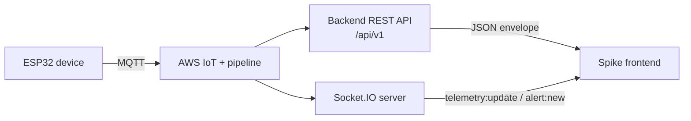
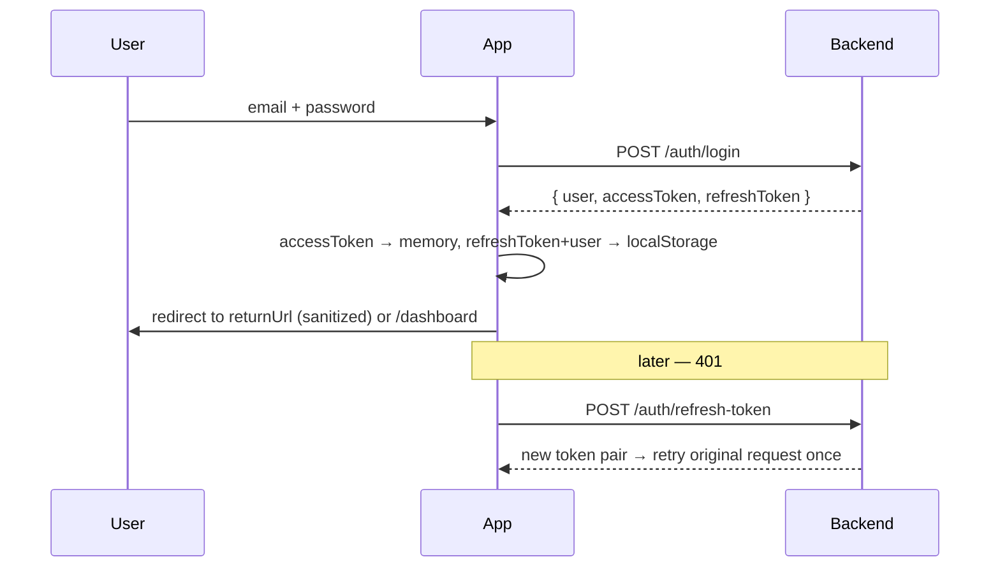

# ⚡ Spike — IoT Energy Monitoring Platform

> Dark-first, data-dense operations console for ESP32-class energy hardware.
> React 19 · TypeScript · TanStack Start/Router · TanStack Query · Tailwind v4 · shadcn/ui · Recharts · Socket.IO · R3F

<p>


</p>

---

## 🚀 Quick start (60 seconds)

```bash
# 1. install
bun install          # or: npm install --legacy-peer-deps

# 2. configure the backend
cp .env.example .env # then edit the two URLs

# 3. run
bun dev              # or: npm run dev   →  http://localhost:8080
```

- [ ] `bun install` finished without peer-dep errors
- [ ] `.env` contains `VITE_API_BASE_URL` **and** `VITE_SOCKET_URL`
- [ ] `/health` responds at the bare origin (not under `/api/v1`)
- [ ] Sign in works and the top-bar dot turns green (socket connected)

---

## 🗺️ The data path



> **The frontend never talks to AWS.** No SDKs, no credentials, no signed requests. Only the REST API and the Socket.IO server.

---

## 🔧 1. Environment setup — the only two variables you need

Create `.env` in the project root:

```bash
VITE_API_BASE_URL=https://your-backend.example.com/api/v1
VITE_SOCKET_URL=https://your-backend.example.com
```

| Variable | Used for | Notes |
| --- | --- | --- |
| `VITE_API_BASE_URL` | every REST call | **must** include `/api/v1` |
| `VITE_SOCKET_URL` | Socket.IO handshake | bare origin, no path |

`src/env.ts` derives a third value, `API_ORIGIN`, from `VITE_API_BASE_URL`. It is used **only** for the unversioned `GET /health`.

> Vite inlines `VITE_*` at build time — restart the dev server after editing `.env`.


## 📡 2. The API client— one wrapper, every request

Every backend response uses the same envelope:

```json
{
  "success": true,
  "message": "OK",
  "data": { },
  "timestamp": "2026-01-01T00:00:00.000Z",
  "requestId": "req_..."
}
```

`src/lib/api/client.ts` is the single door in and out:

| Responsibility | Behaviour |
| --- | --- |
| Unwrap | returns `envelope.data` typed as `T` |
| Auth | attaches `Authorization: Bearer <accessToken>` unless `skipAuth` |
| Cold start | if the in-memory access token is missing but a refresh token exists → silent refresh **before** the call |
| 401 | one shared in-flight refresh (10s grace window), then retry the original request once |
| Failure | throws `ApiError { message, errorCode, status }` |
| Never clears session on | 5xx, 429, network drops — only on 400/401/403 from the refresh endpoint |

```ts
import { dashboardApi } from "@/lib/api/endpoints";
const summary = await dashboardApi.summary(); // already unwrapped
```

**Never** call `fetch` directly from a screen. Add an entry to `src/lib/api/endpoints.ts` instead.

## 🔐 3. Auth & session flow — including the documented security tradeoff



**Storage**

| Item | Where | Why |
| --- | --- | --- |
| `accessToken` | in-memory singleton | a stolen `localStorage` dump has no live token |
| `refreshToken` | `localStorage` | must survive reload — the exposed surface |
| `user` | `localStorage` | renders the shell before the first `/auth/me` |

The backend returns tokens in the JSON body, not `httpOnly` cookies, so JS-readable storage is unavoidable. Mitigations: strict CSP, zero `dangerouslySetInnerHTML`, all API strings rendered as text. Full writeup: `src/lib/auth/README.md`.

**Route protection**

- Everything under `src/routes/_authenticated/` is gated by `beforeLoad`.
- The guard is `ssr: false` — the session lives in the browser, so running it during prerender would bounce every refresh to `/login`.
- The requested path + query + hash is preserved as `?redirect=` and sanitized by `src/lib/auth/returnUrl.ts` (root-relative only, never an auth route).
- Password change / reset → immediate logout, because the backend revokes all sessions.

## 🧭 4. Routing map

| Route | Access | What it does |
| --- | --- | --- |
| `/` | public | marketing page, lazy R3F hero with retry + static fallback |
| `/login` `/register` | public | react-hook-form + zod |
| `/forgot-password` `/reset-password` | public | token-based reset |
| `/dashboard` | auth | fleet KPIs, dynamic charts, recent alerts |
| `/devices` | auth | inventory, cursor pagination, add-device dialog |
| `/devices/$deviceId` | auth | per-device telemetry, stats, alerts, CSV export |
| `/alerts` | auth | fleet alerts (from `dashboard/summary.recentAlerts`) + resolve |
| `/profile` | auth | identity, password, theme |
| `/admin/users` | **admin** | roles, activation, invites, cursor pagination |
| `/forbidden` | auth | wrong-role landing |

Roles come from `useAuth()` (`admin` · `engineer` · `viewer`) and gate both routes and individual controls — non-admins never *see* the Users item.

## 📈 5. Schema-agnostic telemetry — no fixed voltage/current/temperature

A reading is a **flat object with dynamic keys**:

```json
{ "deviceId": "DataLogger001", "timestamp": "...", "temperature_c": 41.2, "load_percent": 66 }
```

Statistics and `dashboard.summary.averages` are keyed the same way:

```json
{ "temperature_c": { "avg": 41.2, "min": 38.0, "max": 44.5 } }
```

`src/lib/telemetry/metrics.ts` turns keys into UI at runtime:

| Key | Rendered as |
| --- | --- |
| `temperature_c` | Temperature (°C) |
| `load_percent` | Load (%) |
| `anything_else` | Anything Else (title-cased) |

One KPI card and one chart are generated **per discovered metric** — adding a field to the firmware requires zero frontend changes. `avg` may be `null` (no telemetry yet) and renders as `—`, never a crash.

**CSV export** (`src/lib/telemetry/csv.ts`) builds a header from every unique key in the loaded range: `timestamp,deviceId,<all metrics>`.


## 🔌 6. Real-time (Socket.IO)

```ts
socket.emit("subscribe:device", deviceId);   // plain string, not an object
socket.on("telemetry:update", reading => …); // rolling window, 120 points
socket.on("alert:new", alert => …);
```

- The top-bar dot reflects the **actual** socket state: idle · connecting · connected · error. Nothing is hardcoded.
- Per-device online/offline comes from the API's `online` boolean, not a guess.
- **Push first, poll second.** While the socket is connected, `/telemetry/:id/latest` polling is disabled entirely; disconnected it falls back to 60s. Other queries sit at 60–120s to stay clear of the backend's 429.


## ⚡ 7. Loading, caching & perceived speed

- **Skeletons only when earned** — `PageSkeleton` appears after a 1000ms threshold, so fast connections never flash.
- **Preload on login** — the dashboard route and its data are warmed the moment credentials succeed.
- **Stale-while-revalidate** — `usePersistedQuery` hydrates from `localStorage` instantly, then refreshes in the background with a subtle indicator.
- **Cursor pagination** — never request an oversized page.

| Endpoint | Page size | Cap |
| --- | --- | --- |
| `GET /devices` | 100 (6 on dashboard) | 100 |
| `GET /users` | 100 | 100 |
| `GET /alerts/device/:id` | 20 | 100 |
| `GET /telemetry/:id/history` | 120 | 200 |

## 🎨 8. Design system

Tokens live in `src/styles.css` as CSS variables inside a Tailwind v4 `@theme` block — dark-first with a light override, toggled by `src/lib/theme/useTheme.ts` and persisted.

`bg-surface-elevated` · `border-surface-stroke` · `text-text-primary` / `secondary` · `ambient-shadow` · `pulse-healthy` · `font-telemetry-data`

> Never hardcode `text-white`, `bg-black`, or `bg-[#hex]` in a component — it breaks theming.

Navigation: collapsible icon sidebar on desktop, keyboard-navigable drawer on mobile with roving focus, persisted section state, and `motion-reduce` support throughout.

## 🗂️ 9. Project layout

```text
src/
├─ routes/                      file-based routing (never edit routeTree.gen.ts)
│  ├─ __root.tsx                head, fonts, CSP, Toaster
│  ├─ index.tsx                 marketing
│  └─ _authenticated/           gated subtree — route.tsx holds the guard
├─ lib/
│  ├─ api/       client · endpoints · types · errors
│  ├─ auth/      tokenStore · AuthProvider · useAuth · returnUrl · README
│  ├─ socket/    socketClient
│  ├─ telemetry/ metrics · csv
│  ├─ swr/       persistedQuery
│  └─ theme/     useTheme
├─ components/   app-shell · auth · dashboard · devices · marketing · ui
└─ env.ts        VITE_API_BASE_URL · VITE_SOCKET_URL · API_ORIGIN
```

## 🧪 10. Scripts & CI

| Command | Purpose |
| --- | --- |
| `bun dev` | dev server on :8080 |
| `bun run build` | production build |
| `bun run typecheck` | TypeScript only |
| `bun run lint` | ESLint |
| `bun run format` | Prettier |

`.github/workflows/ci.yml` installs with npm (`--legacy-peer-deps`, React 19 peers), lints, tests and builds on every push — that's the guard against package-manager drift.


## 🛟 11. Troubleshooting

| Symptom | Cause | Fix |
| --- | --- | --- |
| Refresh bounces to `/login` | guard ran during SSR | guard is `ssr: false`; confirm `spike.refreshToken` exists |
| `401` on every call | missing `/api/v1` in `VITE_API_BASE_URL` | fix `.env`, restart dev server |
| `/health` 404 | health is unversioned | it uses `API_ORIGIN`, not the API base |
| `429` on device detail | polling too fast | socket must be connected; polling then disables itself |
| `409` on add device | Device ID taken | pick another or leave blank to auto-generate |
| Charts empty | no telemetry yet | expected — "Awaiting telemetry" is a real empty state |
| Blank marketing page | 3D chunk failed | retries 3× then falls back to the static hero |


---

## ✅ End-to-end verification

With **zero devices registered and no hardware connected**, a correct build shows:

- [ ] "No devices registered yet" on `/devices`
- [ ] `0 / 0 / 0` device counts and `—` averages on `/dashboard`
- [ ] Disconnected (not green) socket indicator
- [ ] No alerts, no fabricated numbers anywhere

If you see plausible-looking values in that state, something is mocked — that's a bug.

---

<sub>Spike · built on Lovable</sub>
