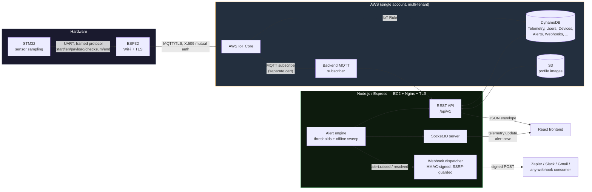

# ⚡ Spike — IoT Energy Monitoring Platform

> A production-deployed, full-stack IoT platform: STM32 sensor hardware → ESP32 → AWS IoT Core → a custom Node.js backend → a real-time React dashboard. Every layer — embedded firmware, cloud infrastructure, backend API, and frontend — designed and built end to end.

<p>


</p>

---

## What this is

Spike is a self-hosted alternative to platforms like Ubidots or Losant, built from the ground up rather than assembled from a vendor SDK. A physical sensor rig (STM32 sampling analog/digital inputs, handed off over UART to an ESP32) publishes signed MQTT telemetry to AWS IoT Core. From there, a backend I designed module-by-module — auth, device management, a threshold-based alert engine, real-time WebSocket push, signed outbound webhooks — serves a live dashboard that updates as data arrives, not on a refresh button.

It's deployed on real infrastructure (AWS EC2, Nginx, Let's Encrypt) that I provision and pay for, not a local demo.

**This repo is a monorepo of four independent workspaces**, each with its own detailed README:

| Workspace | What it is | README |
|---|---|---|
| [`/frontend`](./Data-Logger-Dashboard/Spike_frontend) | React 19 + TanStack Router/Query dashboard, real-time charts, admin panel | [frontend/README.md](./Data-Logger-Dashboard/Spike_frontend/README.md) |
| [`/backend`](./Data-Logger-Backend/Spike_backend) | Node.js/Express API — auth, devices, telemetry, alerts, webhooks, WebSocket | [backend/README.md](./Data-Logger-Backend/Spike_backend/README.md) |
| [`/esp32-firmware`](./Data-Logger-ESP-workspace/esp_to_cloud_connectivity) | ESP32 sketch — UART ingestion from STM32, NTP time sync, MQTT/TLS publish to AWS IoT Core | [esp32-firmware/README.md](./Data-Logger-ESP-workspace/esp_to_cloud_connectivity/README.md) |
| [`/stm32-firmware`](./Data-Logger-Data-Acquisition-using-STM32-Workspace) | STM32 sensor sampling + framed serial protocol to the ESP32 | [stm32-firmware/README.md](./Data-Logger-Data-Acquisition-using-STM32-Workspace/README.md) |

---

## System architecture



**The frontend never talks to AWS directly.** No SDKs, no credentials, no signed requests in the browser — only the backend's REST API and Socket.IO server. AWS is entirely the backend's concern.

---

## The full data path, in words

1. **STM32** samples its sensors and packages a fixed-size binary frame (start byte → length → payload → checksum → end byte) out over UART.
2. **ESP32** parses that frame, validates the checksum, converts it to JSON, and publishes it over **MQTT/TLS with X.509 mutual authentication** directly to **AWS IoT Core** — no intermediate server.
3. An **AWS IoT Rule** routes the message into **DynamoDB**, keyed by `deviceId` + `timestamp`.
4. The **backend** reaches this data two ways:
   - **REST**: reads DynamoDB on demand (`/telemetry/:deviceId/history`, `/dashboard/summary`, etc.)
   - **MQTT subscriber**: a second, separately-certificated client subscribed to the same topic (via a wildcard: `iot/datalogger/+/telemetry`, supporting the whole fleet, not one hardcoded device), which updates each device's live "last seen" status and feeds the alert engine in real time
5. The **alert engine** evaluates every incoming reading against configurable thresholds (voltage, current, temperature) and a background sweep for silent/offline devices — raising alerts once, auto-resolving them the moment conditions normalize, never spamming duplicates.
6. Alerts fan out three ways simultaneously: **Socket.IO** push to connected dashboards, **email** notification to the device owner, and a **signed webhook POST** to any URL the user has registered (Zapier's Catch Hook, Slack, a custom endpoint — anything).
7. The **frontend** renders all of this live — telemetry charts, device status, alert feed — using dynamically-generated schema: whatever fields a device actually publishes, from `voltage` and `current` to `temperature_c` and `ldr_percent`, without a single hardcoded field name anywhere in the UI.

---

## What this project demonstrates

<table>
<tr><td width="33%" valign="top">

**Embedded**
- Custom UART framing protocol with checksums
- STM32 → ESP32 hardware handoff
- NTP time sync on a device with no RTC
- X.509 mutual-TLS MQTT from constrained hardware

</td><td width="33%" valign="top">

**Cloud & Backend**
- AWS IoT Core, DynamoDB, S3, EC2 from scratch — no Amplify, no CDK abstraction hiding the mechanics
- JWT auth with refresh-token rotation
- Role-based access control (admin/engineer/viewer) enforced at the ownership level, not just route level
- Threshold alert engine with dedup + auto-resolve
- Signed, SSRF-guarded outbound webhooks
- Real-time WebSocket fan-out
- Structured logging, OpenAPI docs, 60+ automated tests with AWS mocked at the SDK boundary

</td><td width="33%" valign="top">

**Frontend & Ops**
- Schema-agnostic telemetry rendering (zero hardcoded sensor fields)
- Real-time chart updates via Socket.IO, not polling
- Self-managed deployment: EC2, Nginx reverse proxy, Let's Encrypt TLS, PM2 process management
- Debugged and hardened through a real hardware integration — not a synthetic demo dataset

</td></tr>
</table>

---

## Security posture

- **JWT access + refresh tokens**, refresh tokens rotated and stored hashed (never raw) server-side
- **Row-level multi-tenancy**: every device/telemetry/alert query is scoped by ownership — a Viewer physically cannot query another user's data, enforced in the service layer, not just hidden in the UI
- **X.509 mutual TLS** for every MQTT client (both the ESP32 and the backend's subscriber use separately-issued, individually-revocable certificates)
- **HMAC-SHA256 signed webhook payloads** so receivers can verify authenticity
- **SSRF protection on webhook URLs** — registered endpoints are resolved and checked against private/internal IP ranges before every delivery, not just at registration
- **TLS everywhere in transit**: HTTPS via Let's Encrypt on the API, MQTT/TLS on the device link
- Credential rotation practiced for real during development — an exposed cert was identified and rotated the same day, not left live

---

## Live status

| Component | Status |
|---|---|
| Backend API | ✅ Deployed, HTTPS, EC2 + Nginx |
| Real-time WebSocket | ✅ Verified end-to-end |
| MQTT ingestion (fleet-wide wildcard) | ✅ Live |
| Alert engine + email notifications | ✅ Live |
| Webhooks (Zapier-compatible) | ✅ Live, HMAC-signed |
| Frontend dashboard | ✅ Deployed |
| OTA firmware management | 🔜 Planned |
| Billing / plan tiers | 🔜 Planned |
| SMS / push notification channels | 🔜 Stubbed, not yet implemented |

---

## Getting started

Each workspace is independently runnable — see its own README for exact setup:

```bash
git clone <this-repo>
cd spike

# Backend
cd backend && npm install && cp .env.example .env   # → backend/README.md

# Frontend
cd ../frontend && bun install && cp .env.example .env  # → frontend/README.md

# Firmware (Arduino IDE / STM32CubeIDE)
# → esp32-firmware/README.md
# → stm32-firmware/README.md
```

---

<sub>Designed and built end to end — hardware, cloud, backend, and frontend — by Anirudh Patil.</sub>
